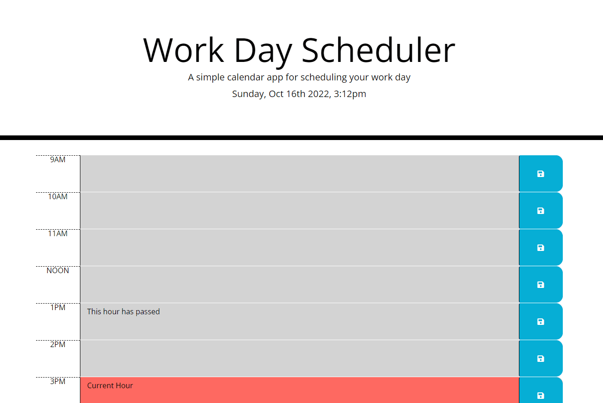

# Work Day Scheduler

## Description
The workday scheduler allows for the user to input their schedule for the day and at a quick glance be able to see if the scheduled items are in the current, past or future hour(s) of the day.

## Technology Used

* HTML
* CSS 
* moment.js
* jQuery
* JavaScript
* Bootstrap

## Usage

When the user wants to update the schedule for a designated time, they can click on the save button and all of their entered text will then be saved to their local storage. At a quick glance the user is able to tell if the time block is in the past (grey), current (red) or future (green). 

## Deployed URL
 <a href="https://jjohnson673.github.io/planning_to_seize_the_day/" target="_blank">Click here to go to the deployed site</a>

## Credits

N/A

## License

N/A
